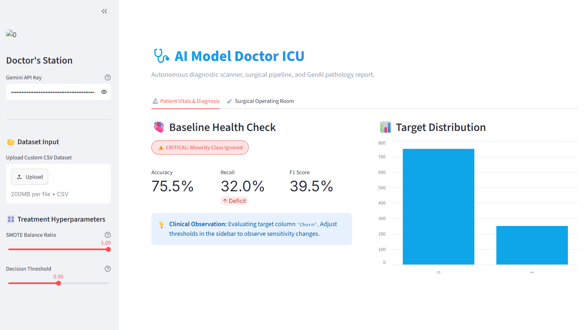
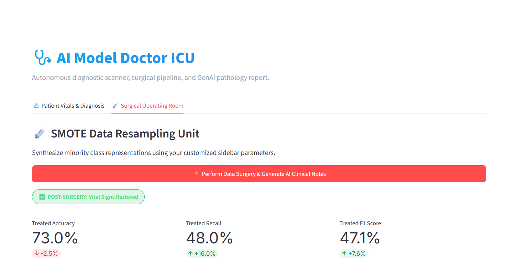

# 🩺 AI Model Doctor — Diagnostic ICU

An autonomous **machine learning diagnostic scanner**, surgical data pipeline, and **Generative AI pathology interface** built to detect and treat severe model class imbalances. 

The application utilizes an interactive medical metaphor to diagnose a "sick" baseline model suffering from severe class under-representation and performs data surgery using **SMOTE** (Synthetic Minority Over-sampling Technique) to restore its vital operational signs.

---

## 🔬 Core Engine Features

* **Automated Health Scanning:** Instantly evaluates classification datasets for major real-world blindspots (like minority class neglect).
* **SMOTE Resampling Unit:** Interactive sliders let you fine-tune the target minority balance ratio and classification decision thresholds on the fly.
* **GenAI Pathology Consultant:** Seamlessly hooks into the **Google Gemini API** (`gemini-3.6-flash`) to generate structured, executive-level diagnostic charts, clinical summaries, and operational prognoses.
* **Dual-Mode Pipeline:** Run headless terminal diagnostics instantly via `app.py` or load the beautiful, premium web app layout using `streamlit_app.py`.

---

## 📊 Live Application Walkthrough

### 🫀 1. Patient Vitals & Diagnosis (Pre-Op)
When an imbalanced dataset is loaded, the dashboard tracks the baseline health check, highlighting critical vulnerabilities such as severely depressed recall scores.



### 💉 2. Surgical Operating Room (Post-Op)
Executing the data surgery pipeline dynamically updates the classification parameters, resamples the boundary manifolds, and outputs real-time comparative vital graphs.



---

## 📋 Case Study: Patient Diagnostic Telemetry
Below is the real-world diagnostic outcome recorded by the platform using a standard target churn distribution:

| Metric | Pre-Op Baseline | Post-Op Status | Variance (Δ) | Clinical Interpretation |
| :--- | :---: | :---: | :---: | :--- |
| **Recall (Sensitivity)** | 32.0% | 48.0% | **+16.0%** | **Significant Recovery:** Model captures +50% more true positive cases. |
| **F1 Score** | 39.5% | 47.1% | **+7.6%** | **Net Harmonic Gain:** Balanced precision and recall footprint improved. |
| **Accuracy** | 75.5% | 73.0% | **-2.5%** | **Expected Tolerance:** Minor accuracy decay due to intentional false-positive elevation. |

**Overall Diagnostic Status:** `STABILIZED & IMPROVED`

---

## 📦 Local Installation & Deployment

### 1. Clone & Navigate
```bash
git clone https://github.com
cd AI-Model-Doctor-Gen-AI
```

### 2. Activate Your Environment
* **Windows:** `.\venv\Scripts\activate`
* **macOS/Linux:** `source venv/bin/activate`

### 3. Install Required Frameworks
```bash
pip install streamlit pandas scikit-learn imbalanced-learn google-genai
```

### 4. Boot Up the Dashboard Station
Force the Streamlit web engine to initialize cleanly on your active port:
```bash
streamlit run streamlit_app.py --server.port 8510
```
*Open your browser to `http://localhost:8510`, paste your Gemini API Key in the sidebar control panel, and run the treatment sequence!*

```
